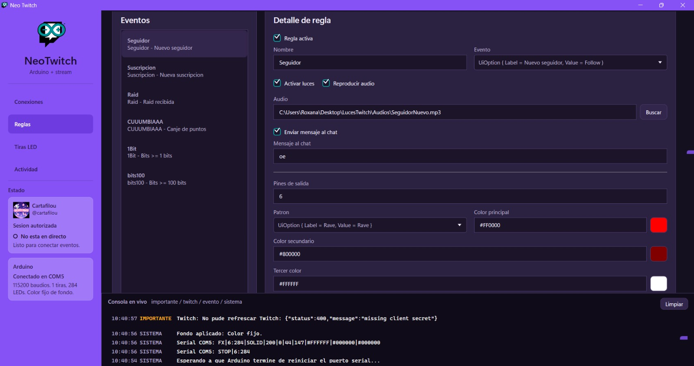
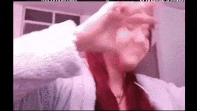

# Neo Twitch

Neo Twitch es una app de Windows hecha en .NET/WPF para convertir eventos de Twitch en alertas de stream: luces NeoPixel con Arduino, luces virtuales, audio, mensajes de chat, escenas de OBS, imagenes, videos y eventos opcionales para Alexa.

La idea es que el streamer configure una vez sus conexiones y luego cree alertas por tipo de evento: nuevos seguidores, suscripciones, raids, bits, comandos de chat y canjes de puntos.

## Descargar

La forma recomendada es usar el instalador:

[Descargar instalador](https://github.com/Dafovi/NeoTwtich/releases/latest/download/NeoTwitch.Installer.exe)

Tambien puedes descargar todas las opciones desde el ultimo release:

[Ver ultimo release](https://github.com/Dafovi/NeoTwtich/releases/latest)

Normalmente se publican estos archivos:

- `NeoTwitch.Installer.exe`: instalador con actualizacion desde GitHub.
- `NeoTwitch-V{version}-Windows.zip`: version portable liviana. Requiere .NET Desktop Runtime compatible.
- `NeoTwitch.exe`: ejecutable autocontenido para usar sin instalar runtime adicional.

Si usas el `.zip`, descomprime la carpeta completa antes de abrir `NeoTwitch.exe`. No ejecutes la app directamente dentro del `.zip` y no borres los archivos que vienen junto al `.exe`.

## Que Hace

- Escucha Twitch por EventSub WebSocket.
- Crea alertas para seguidores, suscripciones, raids, bits, comandos de chat y canjes de puntos.
- Evita disparar alertas si el canal no esta en directo; en ese caso muestra una notificacion en la bandeja.
- Controla tiras NeoPixel con Arduino por USB/Serial.
- Soporta varias salidas LED en distintos pines del mismo Arduino.
- Incluye luces virtuales por OBS o como overlay de pantalla.
- Permite fondos LED y fondos virtuales.
- Reproduce audios locales y permite bibliotecas con grupos aleatorios.
- Administra bibliotecas de imagenes y videos para alertas OBS.
- Cambia escenas de OBS, vuelve a la escena anterior y muestra medios temporales.
- Envia mensajes personalizados al chat.
- Envia eventos opcionales a una integracion Alexa.
- Incluye cola de alertas, diagnostico, backups, importacion/exportacion y modo claro/oscuro.
- Muestra estados de servicios, actividad reciente y una mini consola inferior.
- Avisa cuando existe una nueva version publicada en GitHub.

## Vista Rapida

Ejemplo de una alerta configurada para seguidor:



Ejemplo del efecto activado en stream:



Canal usado para las pruebas visuales: [Cartafilou](https://www.twitch.tv/cartafilou)

## Guias

El README principal queda como resumen. Para configurar o modificar el proyecto, usa estas guias:

- [Guia de configuracion](docs/CONFIGURACION.md): instalacion, Twitch, Arduino, OBS, Alexa, alertas, bibliotecas, luces y diagnostico.
- [Guia tecnica](docs/DESARROLLO.md): arquitectura del repo, carpetas, builds, versionado, debug, protocolo Arduino y servicios principales.
- [Guia completa de Alexa](docs/ALEXA_SETUP.md): paso a paso para crear la Skill, Lambda, Account Linking y rutinas.
- [Atribuciones de iconos](docs/ATRIBUCIONES_ICONOS.md): creditos de iconografia y assets.

## Requisitos

Segun lo que quieras usar:

- Windows.
- Twitch Developer Console para crear una app y obtener el Client ID.
- Arduino IDE con la libreria `Adafruit NeoPixel`, si usaras tiras fisicas.
- OBS Studio con WebSocket activado, si usaras escenas, imagenes, videos o luces virtuales por OBS.
- Una integracion Alexa propia, si usaras rutinas Alexa desde Neo Twitch.

El sketch de Arduino esta en:

[NeoTwitch/Features/Arduino/Sketch/NeoTwitchNeoPixel/NeoTwitchNeoPixel.ino](NeoTwitch/Features/Arduino/Sketch/NeoTwitchNeoPixel/NeoTwitchNeoPixel.ino)

## Configuracion Guardada

Neo Twitch guarda su configuracion en:

```text
%AppData%\NeoTwitch\settings.json
```

Tambien crea backups automaticos en:

```text
%AppData%\NeoTwitch\backups
```

Los archivos exportados pueden incluir tokens, URLs y secretos privados. Tratalos como informacion sensible.

## Desarrollo

La version central se define en `Directory.Build.props` y la configuracion de builds en `build.config.json`.

Comandos principales:

```powershell
.\scripts\build.ps1 -Mode Debug
.\scripts\build.ps1 -Mode Verify
.\scripts\build.ps1 -Mode FullRelease -Clean
.\scripts\release.ps1 -Version 2.2.4 -SigningKeyPath "D:\secure\neo-twitch-release-private.pem" -Clean
```

Mas detalles en [docs/DESARROLLO.md](docs/DESARROLLO.md).

## Creditos

Los creditos de iconos, logos e imagenes estan recopilados en [docs/ATRIBUCIONES_ICONOS.md](docs/ATRIBUCIONES_ICONOS.md).

## License

This project is licensed under the MIT License. See the LICENSE file for details.
