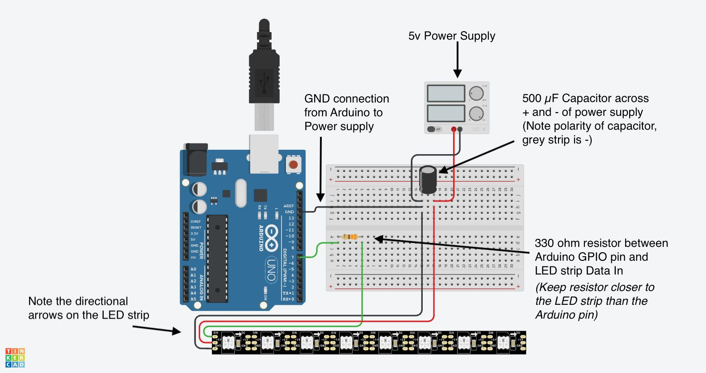

# Guia de Configuracion de Neo Twitch

Esta guia explica como instalar y usar Neo Twitch desde cero. Si quieres cambiar codigo, compilar o entender la arquitectura interna, ve a [DESARROLLO.md](DESARROLLO.md).

## 1. Instalar

La opcion recomendada es el instalador:

[Descargar instalador](https://github.com/Dafovi/NeoTwtich/releases/latest/download/NeoTwitch.Installer.exe)

El instalador descarga el paquete instalable mas reciente desde GitHub, copia los archivos, crea accesos directos si los marcas y deja un actualizador local para futuras versiones.

Si prefieres no instalar:

- Descarga `NeoTwitch-V{version}-Windows.zip` para una carpeta portable.
- Descarga `NeoTwitch.exe` si quieres un ejecutable autocontenido.

No ejecutes la app directamente dentro del `.zip`; descomprimelo primero.

## 2. Primer Arranque

Al abrir la app veras:

- `Inicio`: resumen de conexiones, estadisticas rapidas y actividad reciente.
- `Conexiones`: Twitch, OBS, Arduino y Alexa.
- `Alertas`: creacion y edicion de alertas.
- `OBS`: escenas, fuentes de navegador y opciones visuales para OBS.
- `Luces`: pines, tiras NeoPixel y fondo LED.
- `Alexa`: fondo y eventos Alexa.
- `Audio`, `Videos`, `Imagenes`: bibliotecas de medios y grupos.
- `Actividad`: historial completo.
- `Configuracion`: tema, cierre, autoconexion, backups, diagnostico y cola.

Si una pestaña depende de un servicio desactivado, puede ocultarse o mostrarse con advertencia segun la configuracion.

## 3. Twitch

Neo Twitch usa OAuth Device Code Flow y EventSub WebSocket. La aplicación ya incluye su Client ID público oficial, por lo que no tienes que crear una aplicación en Twitch Developer Console ni manejar credenciales técnicas.

### Conectar Twitch

1. Abre `Conexiones`.
2. Presiona `Conectar Twitch`.
3. Autoriza Neo Twitch en el navegador con el código que muestra la app.
4. Espera a que la aplicación confirme el canal conectado.

No copies Client ID, Client Secret ni URL de redirección. Si actualizaste desde una versión antigua, deberás autorizar una vez más porque el token anterior pertenecía a tu antigua aplicación local de Twitch.

Neo Twitch usa estos permisos:

- `moderator:read:followers`
- `channel:read:subscriptions`
- `channel:read:redemptions`
- `bits:read`
- `user:read:chat`
- `user:write:chat`

### Eventos sin Directo

Si el canal aparece como no directo, Neo Twitch no dispara luces, audio ni OBS para eventos entrantes. En su lugar muestra una notificacion en la bandeja y registra el evento en actividad. Esto evita sustos cuando la app queda abierta fuera de stream.

## 4. OBS

OBS se conecta por `obs-websocket`. En OBS recientes viene incluido.

### Conectar en Neo Twitch

1. Abre `Conexiones`.
2. Presiona `Conectar OBS`. Si OBS está cerrado, Neo Twitch intenta abrirlo automáticamente.
3. Si OBS tiene la autenticación de WebSocket activada, pega la contraseña que OBS muestra en `Herramientas` -> `Ajustes del servidor WebSocket`.
4. Vuelve a presionar `Conectar OBS`.
5. En la pestaña `OBS`, actualiza escenas si hace falta.

Neo Twitch usa automáticamente la conexión local estándar `127.0.0.1:4455`. No necesitas activar una integración adicional ni cambiar host o puerto para una instalación normal de OBS. La contraseña es el único dato que OBS no permite descubrir de forma segura; Neo Twitch la guarda protegida para los siguientes arranques.

### Fuentes y Medios

Neo Twitch puede trabajar de dos maneras:

- Por WebSocket: crea o actualiza fuentes de OBS automaticamente.
- Por fuente de navegador: usas una URL local fija creada por Neo Twitch.

Para imagenes y videos de alerta, por defecto Neo Twitch crea fuentes como:

```text
Neo Twitch - Imagen de alerta
Neo Twitch - Video de alerta
```

Para luces virtuales por OBS, usa:

```text
Neo Twitch - Luces virtuales
```

No tienes que crear estas fuentes a mano si usas el flujo automatico por WebSocket.

La URL de fuente de navegador es util si quieres una fuente fija dentro de una escena. Copiala desde la pestaña `OBS`, crea una `Fuente de navegador` en OBS y pega la URL. Ajusta ancho y alto a la resolucion de tu canvas, por ejemplo `1920 x 1080`.

Guia oficial: [obs-websocket](https://github.com/obsproject/obs-websocket)

## 5. Arduino y NeoPixel

Neo Twitch se comunica con Arduino por USB/Serial.

### Preparar Arduino

1. Instala Arduino IDE.
2. Instala la libreria `Adafruit NeoPixel`.
3. Abre el sketch:

```text
NeoTwitch/Features/Arduino/Sketch/NeoTwitchNeoPixel/NeoTwitchNeoPixel.ino
```

4. Cargalo en el Arduino.
5. Conecta la tira NeoPixel al pin de datos que vas a configurar en Neo Twitch.

### Cableado Recomendado



Recomendaciones:

- Usa fuente externa adecuada para la tira.
- Une GND de la fuente con GND del Arduino.
- Usa resistencia entre pin de datos y `DIN`.
- Usa capacitor entre positivo y negativo cerca del inicio de la tira.
- Respeta la direccion de la tira LED.

Referencia: [Wiring LED Strip to Arduino](https://whatmakeart.com/arduino/wiring-led-strip-to-arduino/)

### Configurar Luces

1. Abre `Conexiones`.
2. Activa Arduino.
3. Detecta o selecciona el puerto COM.
4. Conecta Arduino.
5. Abre `Luces`.
6. Agrega una salida por cada pin digital que controla una tira.
7. Define cantidad de LEDs, patron, colores, brillo y tiempos.
8. Presiona `Aplicar` para enviar el fondo al Arduino.

Si usas muchos LEDs, ten presente que Arduino Uno/Nano tienen poca RAM. El sketch responde `ERR|NO_MEMORY` si no puede reservar memoria para la cantidad configurada.

## 6. Luces Virtuales

Las luces virtuales son independientes de las luces fisicas. Puedes usarlas aunque no tengas Arduino, o combinarlas con Arduino.

Modos:

- `OBS`: crea una fuente que cubre el canvas y simula luz sobre la escena.
- `Pantalla`: muestra un overlay encima de una pantalla seleccionada.

Opciones:

- Pantalla destino.
- Opacidad en OBS.
- Tamano de pixel para overlay de pantalla.
- Saturacion.
- Patron, colores, brillo y tiempos.

En alertas, las luces virtuales toman su propia configuracion y duracion. Si tambien hay audio, video o imagen, la alerta usa la duracion mas larga entre esos medios y los efectos configurados.

## 7. Alertas

Las alertas se filtran por tipo:

- Nuevo seguidor.
- Nueva suscripcion, incluyendo Prime y tiers.
- Raid recibida.
- Bits.
- Comando de chat.
- Canje de puntos.

Para crear una alerta:

1. Abre `Alertas`.
2. Elige la categoria arriba.
3. Usa `Crear alerta de este tipo`.
4. Escribe nombre.
5. Activa las acciones que necesites.
6. Guarda cambios.

Acciones disponibles:

- Luces fisicas.
- Mensaje de chat.
- Audio.
- Video.
- Imagenes.
- OBS.
- Alexa.
- Luces virtuales.

Las acciones que dependen de un servicio desactivado aparecen como no disponibles o se ignoran al ejecutar. Por ejemplo, si Arduino esta desactivado, una alerta no envia comandos LED aunque la regla los tenga configurados.

### Bits

Puedes crear varias alertas de bits con umbrales distintos. Si llega una cantidad alta, Neo Twitch usa la alerta con el umbral mas alto que aplique.

### Comandos de Chat

Para comandos como `!baile`:

1. Crea alerta de tipo `Comando de chat`.
2. Escribe el comando exacto.
3. Configura acciones.

No necesitas estar en directo para leer todos los contextos de chat igual que un stream normal; prueba antes de confiar en ello para directo.

### Mensajes al Chat

Puedes usar variables:

```text
{user}
{bits}
{reward}
{viewers}
{message}
{event}
```

Ejemplo:

```text
Gracias por esos {bits} bits, @{user}
```

## 8. Audio, Imagenes y Videos

Las bibliotecas permiten centralizar archivos y reutilizarlos en varias alertas.

Cada biblioteca tiene:

- Buscador.
- Lista de archivos.
- Duracion o informacion del archivo.
- Boton de prueba.
- Eliminacion.
- Grupos.

Los grupos sirven para elegir un archivo aleatorio cada vez que se active una alerta.

Ejemplos:

- Grupo de audios `Seguidores`.
- Grupo de imagenes `Memes`.
- Grupo de videos `Raids`.

En una alerta puedes elegir archivo individual o grupo.

## 9. Alexa

Neo Twitch no controla dispositivos Alexa directamente. La app envia un evento HTTP a un relay propio, y ese relay avisa a Alexa para disparar rutinas.

Flujo:

```text
Evento Twitch -> Neo Twitch -> Relay Alexa -> Rutina Alexa -> dispositivo
```

La configuracion completa esta en [ALEXA_SETUP.md](ALEXA_SETUP.md).

Resumen:

1. Crear Smart Home Skill.
2. Crear AWS Lambda.
3. Crear Function URL.
4. Configurar Account Linking.
5. Activar permisos de eventos Alexa.
6. Pegar URL/token en Neo Twitch.
7. Crear rutinas en la app de Alexa.

## 10. Configuracion General

En `Configuracion` puedes ajustar:

- Abrir minimizada.
- Iniciar con Windows.
- Tema de la app.
- Comportamiento al cerrar.
- Importar/exportar configuracion.
- Backups.
- Diagnostico.
- Cola de alertas.
- Conectar Twitch, Arduino u OBS al abrir.

### Cola de Alertas

La cola evita que muchas alertas se acumulen sin control.

- `Repetidas maximas en cola`: cuantas alertas iguales pueden esperar.
- `Tiempo minimo para repetir`: cooldown para la misma alerta.
- `Distintas maximas en cola`: cuantas alertas diferentes pueden esperar.
- `Tiempo minimo para distintas`: cooldown entre alertas diferentes.

### Actualizaciones

La app consulta GitHub al abrir. Si hay nueva version:

- Si encuentra el instalador local, puede lanzar la actualizacion.
- Si no lo encuentra, abre la pagina de releases.

El instalador descarga el ultimo asset instalable desde GitHub y evita usar archivos antiguos que esten en la carpeta de descargas.

## 11. Diagnostico y Actividad

Usa `Ejecutar diagnostico` antes de stream para revisar:

- Version.
- Twitch.
- OBS.
- Arduino.
- Alexa.
- Reglas/alertas.
- Bibliotecas.
- Backups.
- Cola.

La pestaña `Actividad` muestra el historial completo con filtros. La mini consola inferior muestra solo el ultimo mensaje y al hacer clic abre `Actividad`.

## 12. Rutas Utiles

Configuracion:

```text
%AppData%\NeoTwitch\settings.json
```

Backups:

```text
%AppData%\NeoTwitch\backups
```

Log de errores:

```text
%AppData%\NeoTwitch\crash.log
```

El archivo activo rota antes de superar 1 MiB y conserva hasta cuatro históricos (`crash.1.log` a `crash.4.log`), eliminando primero el más antiguo.

Overlay OBS:

```text
%AppData%\NeoTwitch\obs-overlay
```

Luces virtuales:

```text
%AppData%\NeoTwitch\virtual-lights
```
